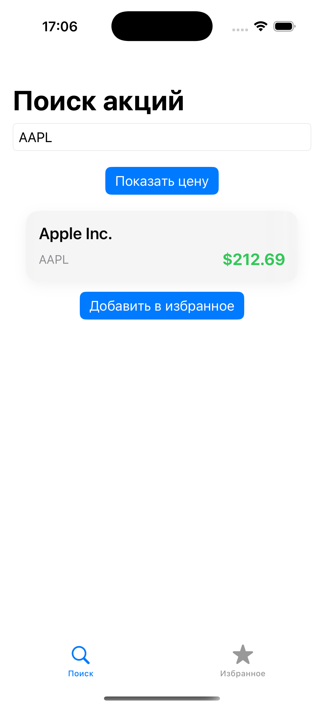
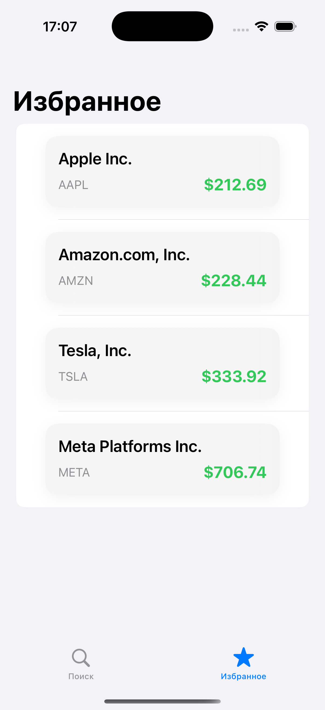

# 📈 StocksTracker

An elegant and powerful iOS app for tracking stocks.  
Built with **SwiftUI + MVVM + CoreData**, designed for speed and scalability.

## 📸 Screenshots

  
  

---

## 🚀 Features

- 🔍 **Real-time search** for stocks by symbol or name  
- ⭐ **Favorites system** — save and manage your favorite stocks  
- 💾 **CoreData support** — all favorites are stored locally  
- 🎨 **Custom UI** with smooth animations and polished visuals  
- 💡 **Fallback logic** when company names are missing  
- ⚙️ **Clean MVVM architecture** for easy scalability

---

## 🛠️ Tech Stack

- `SwiftUI` for modern, declarative UI
- `MVVM` for clear separation of concerns
- `CoreData` for local persistence
- `URLSession` for API requests
- `Combine` (optional) for future reactive updates

---

## 📁 Project Structure

StocksTracker/
├── Models/
├── ViewModel/
├── View/
├── Services/
├── Screenshots/
├── Persistence.swift
└── StocksTrackerApp.swift

## 🧠 Why this project matters

This app demonstrates:
- 🔸 A clean implementation of MVVM in SwiftUI
- 🔸 Real-world usage of CoreData
- 🔸 Best practices in API data parsing and UI updates
- 🔸 Focus on user experience and visual clarity

---

## 📌 Future Enhancements

- 📊 Stock charts and historical data
- 💬 Localization (RU/EN)
- 🔔 Price alerts & notifications
- 📦 Integration with public APIs (e.g., Yahoo Finance, Finnhub)

---

## 🧪 License

MIT — use, modify and share freely.
